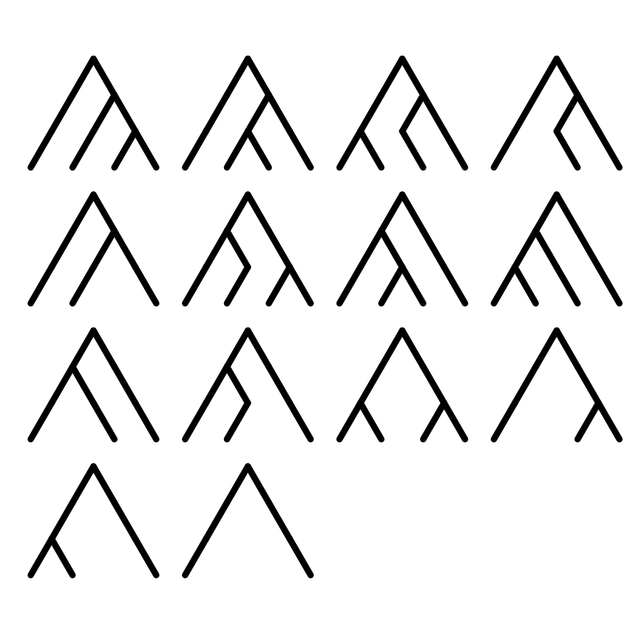
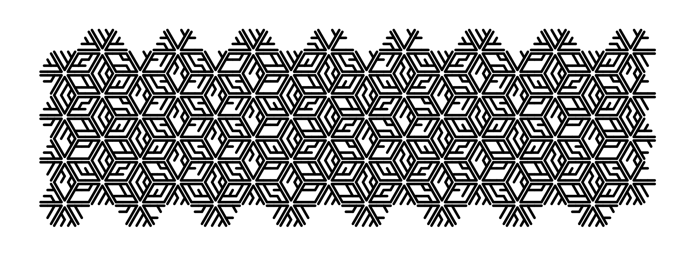

# binarytrees

Create and arrange permutations of binary trees.

This package is for generating line segments making up binary trees for art purposes. I can't imagine anyone has a practical use for this. There are functions for generating the trees, transforming them to create rosettes, and tiling the rosettes. They're independent so that you can use the output at any step for your own purposes, although you'll probably want to use something like ggplot to visualize the outputs. There's a wrapper function that just goes straight from the inputs to the data for plotting tessellated rosettes.

There's also a function for animating radiating rosettes as an SVG, if that sounds exciting.

## Installation
This sure as hell isn't on CRAN, so you'll have to install it from GitHub. The easiest way is to run:
`remotes::install_github("nstauffer/binarytrees")`

## Examples
### Example 1: Tiling
```
# Generate all permutations of binary trees with four layers
# (keeping topologically identical variants)
trees <- generate_trees(n_layers = 4)

# Arrange the trees into rosettes
trees_arranged <- arrange_rosettes(trees = trees,
                                   scale = 1.4,
                                   # There's some randomization so you can get
                                   # different trees in different orientations
                                   # in a given rosette
                                   seed_number = 69)

# Tessellate the rosettes into four rows of four rosettes each
plotting_data <- tile_rosettes(trees = trees_arranged,
                               n_cols = 4,
                               n_rows = 4,
                               # There's some randomization so you can get
                               # different layouts
                               seed_number = 69)


# Alternatively, do it all in one step
plotting_data <- tile_trees(n_layers = 4,
                            n_rows = 8,
                            n_cols = 8,
                            scale = 1.4,
                            seed_number = 69)

ggplot() +
  geom_segment(data = plotting_data,
               aes(x = start_x_coord,
                   y = start_y_coord,
                   xend = end_x_coord,
                   yend = end_y_coord),
               lineend = "round",
               linewidth = 1) +
  coord_equal() +
  theme(panel.background = element_rect(fill = "white"),
        panel.grid = element_blank(),
        axis.title = element_blank(),
        axis.ticks = element_blank(),
        axis.line = element_blank(),
        axis.text = element_blank(),
        legend.position = "none",
        strip.background = element_blank(),
        strip.text = element_blank())
```

So at each stage you can plot the segments to see what you've got. In this case, these are the outputs.

  **Trees:**
  
  
  
  **Rosettes:**
  
  
  
  **Tiling:**
  
  

### Example 2: Animating
```
# This will generate a 5-rosette animation of 5-layer binary trees
animate_rosettes(n_layers = 5,
                 output_path = getwd(),
                 filename = "animation.svg",
                 # Each rosette will spend two seconds radiating,
                 # 0.5 seconds at full growth,
                 # 0.5 seconds fading to 0 opacity,
                 # and 0.25 seconds invisible before the next one
                 # The total animation duration will be the sum of these multiplied
                 # by the number of rosettes.
                 durations = c(draw = 2,
                               hold = 0.5,
                               fade = 0.5,
                               blank = 0.25),
                 scale = 1.4,
                 # A sort of "tomato bisque" on "seafoam" situation
                 tree_color = "#f87580",
                 background_color = "#a5e8e3",
                 # There will be way more than 5 rosettes generated,
                 # but the animation noticeably stutters on some
                 # devices with more than a handful of rosettes
                 max_rosettes = 5,
                 # There's some randomization so you can get
                 # different rosettes
                 seed_number = 69)
```

